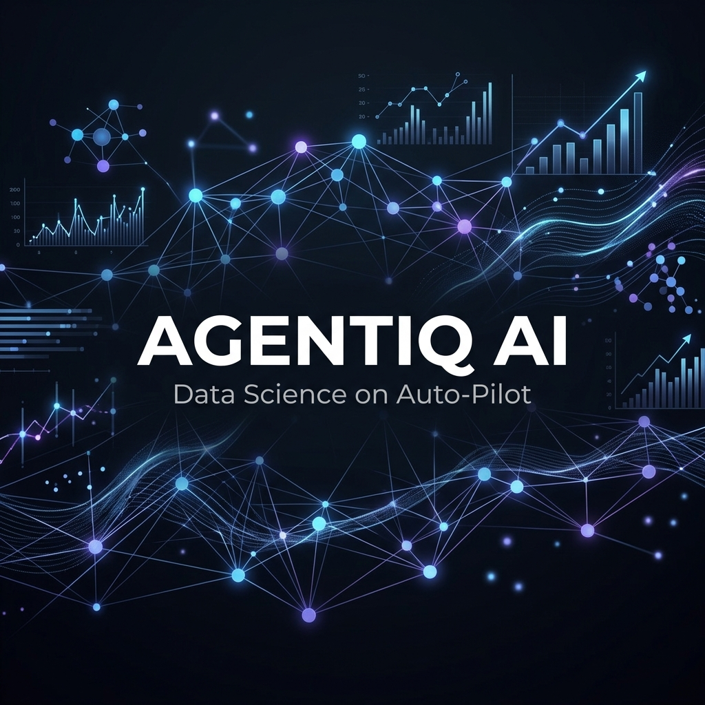
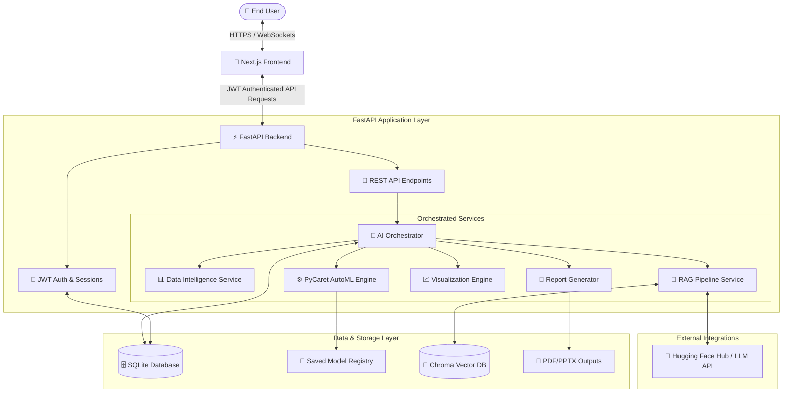

<p align="center">
  
</p>

<h1 align="center">AGENTIQ AI</h1>
<p align="center"><strong>Data Science on Auto-Pilot</strong></p>

<p align="center">
  <em>Upload data. Let AI analyze, build models, explain insights, and generate reports automatically.</em>
</p>

<p align="center">
  <a href="https://python.org"></a>
  <a href="https://fastapi.tiangolo.com"></a>
  <a href="https://nextjs.org"></a>
  <a href="https://pycaret.org"></a>
  <a href="https://sqlite.org"></a>
  <a href="https://github.com/chroma-core/chroma"></a>
  <br />
  <a href="https://github.com/Ravivarman15/AgentIQ-AI/blob/main/LICENSE"></a>
  <a href="https://github.com/Ravivarman15/AgentIQ-AI/stargazers"></a>
  <a href="https://github.com/Ravivarman15/AgentIQ-AI/network/members"></a>
  <a href="https://github.com/Ravivarman15/AgentIQ-AI/issues"></a>
</p>

---

## 📖 Table of Contents

- [1. About Project](#-1-about-project)
- [2. Problem Statement](#-2-problem-statement)
- [3. Solution](#-3-solution)
- [4. Key Features](#-4-key-features)
- [5. Technology Stack](#-5-technology-stack)
- [6. System Architecture](#-6-system-architecture)
- [7. Complete Workflow](#-7-complete-workflow)
- [8. Project Structure](#-8-project-structure)
- [9. Machine Learning Pipeline](#-9-machine-learning-pipeline)
- [10. Supported Datasets](#-10-supported-datasets)
- [11. Model Performance & Evaluation](#-11-model-performance--evaluation)
- [12. Product Screenshots](#-12-product-screenshots)
- [13. Installation Guide](#-13-installation-guide)
- [14. Deployment Architecture](#-14-deployment-architecture)
- [15. Future Roadmap](#-15-future-roadmap)
- [16. Contributing](#-16-contributing)
- [17. License](#-17-license)
- [18. Author](#-18-author)
- [19. Support & Star](#-19-support--star)

---

## 🌟 1. About Project

**AGENTIQ AI** is an AI-powered end-to-end data science automation platform that enables users to upload structured datasets and automatically perform intelligent data analysis, preprocessing, AutoML model selection, prediction, visualization, Retrieval-Augmented Generation (RAG) chat, and professional report generation.

The platform is designed to eliminate the complexity of traditional data science by combining AI Agents, Large Language Models, AutoML, and interactive analytics into a single production-ready application.

### Why This Project Exists
Data science is one of the most critical drivers of modern business value, yet it remains bottlenecked by high operational complexity and a severe shortage of skilled personnel. Many companies struggle to bridge the gap between storing raw data and extracting actionable machine learning predictions. AGENTIQ AI democratizes data science, making it accessible to analysts, developers, and business stakeholders without requiring deep expertise in statistics or programming.

### Current Challenges in Data Science
1. **The Talent Shortage:** Hiring experienced data scientists is expensive and time-consuming.
2. **Operational Overhead:** Engineers spend up to 80% of their time on repetitive data cleaning, preprocessing, and model training rather than drawing business insights.
3. **Complexity of ML Lifecycles:** Designing pipelines, selecting algorithms, hyperparameter tuning, and model validation are error-prone manual tasks.
4. **Communication Gap:** Stakeholders struggle to interpret raw model metrics (like AUC or MSE). Explaining ML outcomes requires visualization and natural language summaries.

### The Manual Workflow vs. AGENTIQ AI
* **Manual Workflow:** Writing custom pandas scripts $\rightarrow$ cleaning missing values $\rightarrow$ encoding categories $\rightarrow$ manually checking correlations $\rightarrow$ setting up grid search across multiple libraries (Scikit-Learn, XGBoost, etc.) $\rightarrow$ generating static charts $\rightarrow$ typing a summary report $\rightarrow$ deploying a flask container.
* **AGENTIQ AI:** A single file upload starts a multi-agent orchestrated pipeline that auto-cleans, runs PyCaret AutoML, explains the findings via LLM summaries, generates downloadable PDF/PowerPoint reports, and initiates an interactive RAG chat session.

---

## ⚠️ 2. Problem Statement

The traditional data science workflow is a linear, multi-stage process with numerous failure points. Executing this manually requires high proficiency in coding, statistics, machine learning algorithms, and presentation design.

```
                  ┌──────────────────────┐
                  │       Dataset        │
                  └──────────┬───────────┘
                             │
                             ▼
                  ┌──────────────────────┐
                  │    Data Cleaning     │
                  └──────────┬───────────┘
                             │
                             ▼
                  ┌──────────────────────┐
                  │         EDA          │
                  └──────────┬───────────┘
                             │
                             ▼
                  ┌──────────────────────┐
                  │ Feature Engineering  │
                  └──────────┬───────────┘
                             │
                             ▼
                  ┌──────────────────────┐
                  │   Model Selection    │
                  └──────────┬───────────┘
                             │
                             ▼
                  ┌──────────────────────┐
                  │    Model Training    │
                  └──────────┬───────────┘
                             │
                             ▼
                  ┌──────────────────────┐
                  │   Model Evaluation   │
                  └──────────┬───────────┘
                             │
                             ▼
                  ┌──────────────────────┐
                  │    Visualization     │
                  └──────────┬───────────┘
                             │
                             ▼
                  ┌──────────────────────┐
                  │  Report Generation   │
                  └──────────┬───────────┘
                             │
                             ▼
                  ┌──────────────────────┐
                  │   Model Prediction   │
                  └──────────────────────┘
```

### Why This Is Difficult:
* 💻 **Coding Overhead:** Writing custom Python code using pandas, numpy, scikit-learn, and matplotlib is verbose, repetitive, and hard to maintain across projects.
* 📈 **Statistical Rigor:** Missing data handling, outlier detection, scaling, encoding, and target imbalance handling must be done correctly to prevent data leakage and bias.
* 🤖 **Algorithm Overwhelm:** Navigating hyperparameters, model selection, ensemble methods, and cross-validation requires deep machine learning expertise.
* ⌛ **Time Constraints:** Running experiments takes hours or days. Creating customer-facing presentations or detailed PDF reports adds further delays.

---

## ⚡ 3. Solution

AGENTIQ AI eliminates manual friction by orchestrating an end-to-end autonomous pipeline. It wraps best-in-class AutoML (PyCaret) and Generative AI (RAG and LLMs) into an intuitive, responsive system.

### Automated End-to-End Workflow

```
   ┌──────────────────────┐
   │    Dataset Upload    │
   └──────────┬───────────┘
              │
              ▼
   ┌──────────────────────┐
   │ AI Data Intelligence │
   └──────────┬───────────┘
              │
              ▼
   ┌──────────────────────┐
   │ LLM Data Navigation  │
   └──────────┬───────────┘
              │
              ▼
   ┌──────────────────────┐
   │   Automated Cleaning │
   └──────────┬───────────┘
              │
              ▼
   ┌──────────────────────┐
   │ Feature Engineering  │
   └──────────┬───────────┘
              │
              ▼
   ┌──────────────────────┐
   │    PyCaret AutoML    │
   └──────────┬───────────┘
              │
              ▼
   ┌──────────────────────┐
   │ Train Multi-Models   │
   └──────────┬───────────┘
              │
              ▼
   ┌──────────────────────┐
   │ Compare Leaderboard  │
   └──────────┬───────────┘
              │
              ▼
   ┌──────────────────────┐
   │  Best Model Select   │
   └──────────┬───────────┘
              │
              ▼
   ┌──────────────────────┐
   │   Model Prediction   │
   └──────────┬───────────┘
              │
              ▼
   ┌──────────────────────┐
   │  Model Explainability│
   └──────────┬───────────┘
              │
              ▼
   ┌──────────────────────┐
   │ RAG Chat & Insights  │
   └──────────┬───────────┘
              │
              ▼
   ┌──────────────────────┐
   │ Dynamic Visuals      │
   └──────────┬───────────┘
              │
              ▼
   ┌──────────────────────┐
   │ PDF & PPTX Reports   │
   └──────────────────────┘
```

By uploading a file, AGENTIQ AI analyzes its structure, determines the ML task, cleans outliers and null values, compares multiple models, saves the best candidate, exposes a prediction API, indices insights in a vector database for natural language RAG queries, and generates ready-to-present executive summaries.

---

## ✨ 4. Key Features

The platform offers a comprehensive feature set categorized for modern enterprise demands:

| Category | Feature | Status | Description |
| :--- | :--- | :---: | :--- |
| **Data Ingestion** | Multiple Formats | ✔ | Seamlessly parse and validate CSV, Excel (`.xlsx`, `.xls`), and JSON datasets. |
| | Size Optimization | ✔ | Efficient DataFrame loading with schema auto-inference and data-type validation. |
| **Data Prep** | Missing Value Detection | ✔ | Automatically identify, summarize, and impute missing data utilizing strategic statistical fallbacks. |
| | Outlier & Duplicate Analysis | ✔ | Detect anomalies, outliers, and redundant rows to enhance model cleanliness. |
| | Correlation Analysis | ✔ | Compute feature-to-feature and feature-to-target correlations to highlight critical relationships. |
| **AutoML Engine** | PyCaret Integration | ✔ | Run advanced low-code machine learning setups including automated data scaling and encoding. |
| | Multi-Model Training | ✔ | Train up to a dozen classifiers or regressors simultaneously to locate the best pipeline. |
| | Metric Leaderboards | ✔ | View models ranked by validation metrics such as F1-Score, ROC-AUC, Accuracy, or R² and RMSE. |
| | Best Model Selection | ✔ | Finalize, save, and register the top-scoring pipeline for downstream prediction tasks. |
| **Explainable AI** | Feature Importance | ✔ | Calculate and plot relative feature weights to understand what drives the model's predictions. |
| | Plain English Insights | ✔ | LLM-generated explanations translating complex metrics into actionable summaries. |
| **RAG & Search** | Vector Indexing | ✔ | Embed dataset summaries, schema structures, and analytical findings into ChromaDB. |
| | Natural Language Q&A | ✔ | Ask questions ("Which feature impacts the target most?") and get grounded responses. |
| **Reporting** | PDF Export | ✔ | Download detailed, professional PDF documents summarizing the EDA, model results, and graphs. |
| | PowerPoint Slides | ✔ | Export clean PowerPoint decks ready for executive presentations. |
| **User Interface** | Modern Dashboard | ✔ | Interactive React/Next.js dashboard styling, smooth transitions, and charts. |
| | Dark Mode | ✔ | Sleek dark-mode aesthetic designed to maximize readability. |
| | User Authentication | ✔ | JWT-based user login and registration to ensure dataset isolation and security. |

---

## 🛠️ 5. Technology Stack

### Frontend Architecture
| Technology | Description | Role |
| :--- | :--- | :--- |
| **Next.js 14** | React Framework with App Router | System routing, server-rendered components, optimized bundle delivery. |
| **React** | Component-based UI Library | Core user interface structure and state management. |
| **TypeScript** | Strongly typed JavaScript | Code safety, precise interfaces, and compile-time validation. |
| **Tailwind CSS** | Utility-first CSS Framework | Clean responsive layouts and modern design aesthetics. |
| **ShadCN UI** | Radix-based UI Primitives | Premium modular components (inputs, modals, dialogs, charts). |

### Backend Service
| Technology | Description | Role |
| :--- | :--- | :--- |
| **FastAPI** | High-performance Python web framework | REST API endpoints, user authentication, async routing, file handling. |
| **Python 3.10+** | Core programming language | Execution environment for AI orchestration and AutoML logic. |

### Machine Learning & Data Processing
| Technology | Description | Role |
| :--- | :--- | :--- |
| **PyCaret** | Low-code machine learning library | The core AutoML engine managing preprocessing, model comparison, tuning, and save. |
| **Scikit-Learn** | Core machine learning primitives | Statistical tools, dataset splits, metrics evaluation, and baseline models. |
| **Pandas** | Data analysis & manipulation library | Structured tabular data parsing, cleaning, scaling, and grouping operations. |
| **NumPy** | Multi-dimensional array processing | Fast mathematical operations and vector transformations. |

### AI, Vector Search, & RAG
| Technology | Description | Role |
| :--- | :--- | :--- |
| **Hugging Face Hub API** | Language Model Host | Generates analytical insights and conversational answers. |
| **ChromaDB** | Vector Database | Stores chunked data representations and analytical logs for semantic RAG queries. |
| **Sentence Transformers** | Text Embeddings | Computes high-dimensional vector embeddings for indexing and search. |

### Storage & Infrastructure
| Technology | Description | Role |
| :--- | :--- | :--- |
| **SQLite** | Relational SQL database engine | Stores user registrations, JWT details, execution history, and task statuses. |
| **Render** | Cloud hosting platform | Deploys backend containers and database processes. |
| **Vercel** | Serverless hosting platform | Hosts the static/SSG Next.js frontend application with global CDN routing. |

---

## 🏗️ 6. System Architecture

The following diagram details the interactions between the components of AGENTIQ AI:



---

## 🔄 7. Complete Workflow

Below is the execution flow from the moment a user uploads a file to the generation of insights:

```mermaid
flowchart TD
    A[📁 User Uploads Dataset] --> B{🔍 File Format Valid?}
    B -- No --> C[❌ Reject & Show Error]
    B -- Yes --> D[⚙️ Auto-Detect Schema & Missing Data]
    
    D --> E[📊 Compute Correlation & Statistical Profiling]
    E --> F[🧠 LLM Reads Schema & Generates Domain Insights]
    
    F --> G{🎯 ML Task Type?}
    G -- Categorical Target --> H[🤖 Classification Pipeline]
    G -- Numeric Target --> I[🤖 Regression Pipeline]
    
    subgraph AutoML Pipeline (PyCaret)
        H & I --> J[🛠️ Automatic Preprocessing & Imputation]
        J --> K[🏋️ Compare Multiple Algorithms]
        K --> L[📊 Generate Metric Leaderboard]
        L --> M[🏆 Select Highest-Performing Model]
    end
    
    M --> N[💾 Save Model Artifact & Expose Prediction API]
    M --> O[📊 Plot Feature Importances & Chart Visualizations]
    M --> P[📄 Compile PDF & PowerPoint Reports]
    M --> Q[💬 Index Insights in ChromaDB for Chat]
    
    Q --> R[💬 User Interacts via RAG Chat Interface]
```

---

## 📂 8. Project Structure

AGENTIQ AI is organized as a monorepo containing distinct frontend and backend directories:

```text
.
├── backend/                   # FastAPI backend application
│   ├── app/                   # Backend application source code
│   │   ├── api/               # API endpoints (auth, upload, chat, models)
│   │   ├── config/            # Application settings & environment configuration
│   │   ├── services/          # Core pipeline services
│   │   │   ├── data_processing.py    # Dataset parsing, cleaning, and profiling
│   │   │   ├── ml_pipeline.py        # PyCaret setup, training, and selection
│   │   │   ├── orchestrator.py       # Manages execution flow
│   │   │   ├── rag_pipeline.py       # Document indexing and vector query
│   │   │   ├── report_generator.py   # PDF & PPTX file compiles
│   │   │   └── visualization.py      # Plotly/Matplotlib image rendering
│   │   ├── models/            # SQLAlchemy schemas & DB models
│   │   ├── utils/             # Helper utilities (task detection, logging)
│   │   └── state.py           # Global application state management
│   ├── chroma_db/             # Local database for Chroma DB vector stores
│   ├── uploads/               # Temporary user dataset storage directory
│   ├── tests/                 # Backend testing suite
│   ├── requirements.txt       # Python package dependencies
│   └── Dockerfile             # Production deployment container definition
├── frontend/                  # Next.js frontend application
│   ├── app/                   # Next.js App Router directories
│   │   ├── login/             # Login page
│   │   ├── register/          # Register page
│   │   └── page.tsx           # Interactive AutoML Dashboard
│   ├── components/            # Reusable UI Components
│   │   ├── AgentProgress.tsx  # Dynamic multi-agent progress status
│   │   ├── DynamicChart.tsx   # Interactive visualization components (Recharts)
│   │   ├── LandingSections.tsx # Product landing pages & marketing sections
│   │   └── PredictionTab.tsx  # Inference & explainability UI interface
│   ├── services/              # API Client Service calls (axios)
│   ├── public/                # Static assets (icons, images)
│   └── package.json           # Frontend dependency manifest
├── assets/                    # Project documentation assets (banners, screenshots)
├── render.yaml                # Infrastructure configuration for Render deployment
└── README.md                  # Project documentation (this file)
```

---

## ⚙️ 9. Machine Learning Pipeline

AGENTIQ AI utilizes **PyCaret** to orchestrate its machine learning pipelines. The ML life cycle is fully automated and runs through the following stages:

```
[Target Detection] ──> [Data Split & Preprocess] ──> [Model Comparison] ──> [Tuning & Ensembling] ──> [Finalize & Save]
```

### 1. Auto-Detection of Task Type
The system scans the unique values of the user-designated target column:
* **Classification:** Triggered when the target contains discrete classes (boolean, text, or integers with low cardinality).
* **Regression:** Triggered when the target column contains continuous numerical values.

### 2. Preprocessing & Imputation
PyCaret initializes the training environment automatically, applying standard data preparations:
* Missing numerical values are imputed using the column **median**.
* Missing categorical values are imputed using the column **mode**.
* Categorical columns are converted using **One-Hot Encoding**.
* Data is scaled to ensure algorithm convergence.

### 3. Model Comparison & Leaderboard
The pipeline compares candidate algorithms in parallel. The training features K-fold cross-validation to prevent overfitting.
* **Classification Candidates:** Logistic Regression, Random Forest, LightGBM, XGBoost, Gradient Boosting, Extra Trees, AdaBoost, Decision Trees, K-Nearest Neighbors, SVM.
* **Regression Candidates:** Linear Regression, Ridge, Lasso, Elastic Net, Random Forest, LightGBM, XGBoost, Gradient Boosting, Extra Trees, AdaBoost.

### 4. Selection and Explanation
Once the validation completes:
1. The model with the highest metric (e.g. F1-Score or R²) is chosen.
2. Feature importances are computed.
3. The model object is finalized (retrained on the full dataset) and saved as a `.pkl` pipeline file.

---

## 📊 10. Supported Datasets

AGENTIQ AI handles diverse tabular data formats with automatic structure detection.

### Supported File Types
* **CSV (`.csv`):** Standard comma-separated values.
* **Excel (`.xlsx`, `.xls`):** Parses sheets, headers, and cell structures.
* **JSON (`.json`):** Decodes arrays of objects or key-value structures.

### Dataset Specifications
* **Dataset Size:** Built-in chunking handles files up to **100MB** within standard memory envelopes.
* **Automatic Schema Detection:** The engine distinguishes between continuous numeric features, high-cardinality categorical columns, dates, text, and labels.

### Examples of Target Industries
To guide users, sample datasets are provided in the `/backend/sample_datasets` directory:
* 🏥 **Healthcare:** Patient readmission indicators and clinical risk metrics.
* 🛍️ **Retail:** Customer churn prediction and transaction value analysis.
* 💳 **Finance:** Credit scoring card risk metrics and fraud classification.
* 🏠 **Real Estate:** Property price assessment variables.
* 🎓 **Education:** Student grades, attendance, and dropout predictions.

---

## 📈 11. Model Performance & Evaluation

Rather than fabricating metrics, AGENTIQ AI provides real-time performance evaluation. When PyCaret completes the run, the system outputs the exact scores calculated during validation.

### Evaluation Metrics Evaluated By Task

#### Classification Metrics:
* **Accuracy:** Overall percentage of correct classifications.
* **Precision:** True positives divided by predicted positives.
* **Recall:** True positives divided by actual positives.
* **F1-Score:** Harmonic mean of Precision and Recall.
* **ROC-AUC:** Area Under the Receiver Operating Characteristic curve.

#### Regression Metrics:
* **Mean Absolute Error (MAE):** Average absolute difference between predictions and targets.
* **Mean Squared Error (MSE):** Average squared difference between predictions and targets.
* **Root Mean Squared Error (RMSE):** Square root of the average squared difference.
* **R-squared ($R^2$):** Proportion of variance in the target explained by the features.

### Leaderboard Output Format
The results are displayed in a clean tabular grid on the frontend dashboard:

| Rank | Model Name | Metric 1 (F1-Score / R²) | Metric 2 (Accuracy / RMSE) | Status |
| :---: | :--- | :---: | :---: | :---: |
| 🥇 | **Random Forest** | 0.912 | 0.895 | *Selected* |
| 🥈 | **XGBoost Classifier** | 0.898 | 0.881 | *Candidate* |
| 🥉 | **LightGBM Classifier** | 0.885 | 0.874 | *Candidate* |
| 4 | **Logistic Regression** | 0.821 | 0.815 | *Candidate* |

---

## 📸 12. Product Screenshots

Here are visual representations of the platform interface. Place custom screenshots in the `assets/` directory to display them:

<p align="center">
  <strong>🏠 Home Page / Landing Section</strong><br />
  
</p>

<p align="center">
  <strong>📊 Main AutoML Dashboard</strong><br />
  
</p>

<p align="center">
  <strong>📁 Dataset Upload & Schema Configuration</strong><br />
  
</p>

<p align="center">
  <strong>🤖 PyCaret AutoML In-Progress Pipeline</strong><br />
  
</p>

<p align="center">
  <strong>🏆 Model Leaderboard Rankings</strong><br />
  
</p>

<p align="center">
  <strong>🔮 Interactive Inference & Predictions</strong><br />
  
</p>

<p align="center">
  <strong>📈 Explanations & Feature Importance Charts</strong><br />
  
</p>

<p align="center">
  <strong>💬 Conversational RAG Q&A Interface</strong><br />
  
</p>

<p align="center">
  <strong>📄 Downloadable PDF Report</strong><br />
  
</p>

<p align="center">
  <strong>👔 Professional PowerPoint Presentation Slide Deck</strong><br />
  
</p>

---

## 🚀 13. Installation Guide

Follow these steps to set up AGENTIQ AI on your local workstation:

### Prerequisites
* **Python:** 3.10 or 3.11 installed.
* **Node.js:** v18 or v20 installed.
* **Git** command-line interface.

### Step 1: Clone the Repository
```bash
git clone https://github.com/Ravivarman15/AgentIQ-AI.git
cd AgentIQ-AI
```

### Step 2: Configure & Run the Backend API

1. Navigate to the backend directory:
   ```bash
   cd backend
   ```
2. Create and activate a Python virtual environment:
   ```bash
   python -m venv venv
   # On Windows:
   venv\Scripts\activate
   # On macOS/Linux:
   source venv/bin/activate
   ```
3. Install package dependencies:
   ```bash
   pip install -r requirements.txt
   ```
4. Create your local environment configuration file:
   ```bash
   cp .env.example .env
   ```
   Edit the newly created `.env` file with your credentials:
   ```env
   HUGGINGFACEHUB_API_TOKEN=hf_your_hugging_face_token
   SECRET_KEY=generate_a_random_jwt_secret_key
   DATABASE_URL=sqlite:///./agentiq.db
   ```
5. Run the FastAPI development server:
   ```bash
   uvicorn app.main:app --reload --port 8000
   ```
   The backend API documentation is now accessible at [http://localhost:8000/docs](http://localhost:8000/docs).

### Step 3: Configure & Run the Next.js Frontend

1. Open a new terminal window and navigate to the frontend directory:
   ```bash
   cd frontend
   ```
2. Install the frontend dependencies:
   ```bash
   npm install
   ```
3. Create your local environment configuration file:
   ```bash
   cp .env.local.example .env.local
   ```
   Ensure the API target points to your local backend:
   ```env
   NEXT_PUBLIC_API_URL=http://localhost:8000
   ```
4. Run the frontend development server:
   ```bash
   npm run dev
   ```
   Open your browser and navigate to [http://localhost:3000](http://localhost:3000) to view the application interface.

---

## ☁️ 14. Deployment Architecture

AGENTIQ AI is designed for seamless cloud deployment.

### 🎨 Frontend Deployment: Vercel
Vercel is the recommended hosting platform for the Next.js frontend application.
* **Framework Preset:** Next.js
* **Build Command:** `npm run build`
* **Output Directory:** `.next`
* **Environment Variables:** Set `NEXT_PUBLIC_API_URL` to point to your hosted FastAPI backend domain.

### ⚡ Backend Deployment: Render
You can deploy the FastAPI backend to Render using a Docker container or Python Web Service.
* **Environment Configuration:** Use Python 3.10+ runtime.
* **Build Command:** `pip install -r requirements.txt`
* **Start Command:** `uvicorn app.main:app --host 0.0.0.0 --port $PORT`
* **Required Production Env Vars:**
  * `DATABASE_URL`: Production SQL Connection string (e.g. hosted Postgres on Supabase).
  * `HUGGINGFACEHUB_API_TOKEN`: Your API authentication token.
  * `SECRET_KEY`: Long random string for encoding JWT credentials.

### 🗄️ Database Strategy
* **Relational DB:** For local development, SQLite is configured. For production workloads, migrate to a PostgreSQL instance (e.g., Supabase PostgreSQL) by updating the `DATABASE_URL` connection string.
* **Vector DB:** ChromaDB initializes as a persistent local folder storage system. For high-scale staging, migrate to a managed vector DB instance.

---

## 🗺️ 15. Future Roadmap

We are continuously working on new capabilities for AGENTIQ AI. Here is our upcoming roadmap:

- [ ] **Orchestration & Scale:**
  - Docker Compose setups for easy multi-container orchestration.
  - Kubernetes helm charts for managing elastic worker pools under load.
- [ ] **Security & Credentials:**
  - SSO integration (Google, GitHub, and Enterprise SAML).
  - Fine-grained role-based access control (RBAC) configurations.
- [ ] **Infrastructure & Cloud Integrations:**
  - Automated deployment pipelines for AWS, Microsoft Azure, and Google Cloud Platform.
  - Fully integrated CI/CD workflows using GitHub Actions.
- [ ] **MLOps Lifecycle Management:**
  - Centralized MLflow Model Registry to track experiment details, hyperparameter versions, and model lineages.
- [ ] **Advanced Features:**
  - Real-time streaming prediction endpoints using WebSockets.
  - Interactive forecasting modules for Time Series analysis.
  - Deep Learning modules for PyTorch-based image analysis and audio models.
  - Voice Assistant capabilities enabling voice-directed analysis.
- [ ] **Swarm Orchestration:**
  - Multi-Agent swarm workflows using LangGraph for collaborative debugging and data cleaning.

---

## 🤝 16. Contributing

Contributions are what make the open-source community such an amazing place to learn, inspire, and create. Any contributions you make are **greatly appreciated**.

### How to Contribute
1. **Fork the Project**
2. **Create your Feature Branch** (`git checkout -b feature/AmazingFeature`)
3. **Commit your Changes** (`git commit -m 'Add some AmazingFeature'`)
4. **Push to the Branch** (`git push origin feature/AmazingFeature`)
5. **Open a Pull Request**

### Code Quality Guidelines
* Follow PEP 8 guidelines for Python code.
* Use ESLint and Prettier for formatting React/TypeScript components.
* Ensure all database models feature matching migrations.
* Document new services in their respective code modules.

---

## 📄 17. License

Distributed under the MIT License. See `LICENSE` for more information.

---

## 👤 18. Author

<p align="center">
  <strong>Ravivarman R</strong><br />
  <em>AI Engineer | Data Scientist | Full Stack AI Developer</em>
</p>

<p align="center">
  <a href="https://github.com/Ravivarman15"></a>
  <a href="https://linkedin.com/in/ravivarman-r-placeholder"></a>
  <a href="https://ravivarman.dev-placeholder"></a>
</p>

---

## ⭐ 19. Support & Star

If you found AGENTIQ AI useful, consider giving this repository a ⭐. It motivates continued development and helps others discover the project.

<p align="center">
  <a href="https://github.com/Ravivarman15/AgentIQ-AI"></a>
</p>
